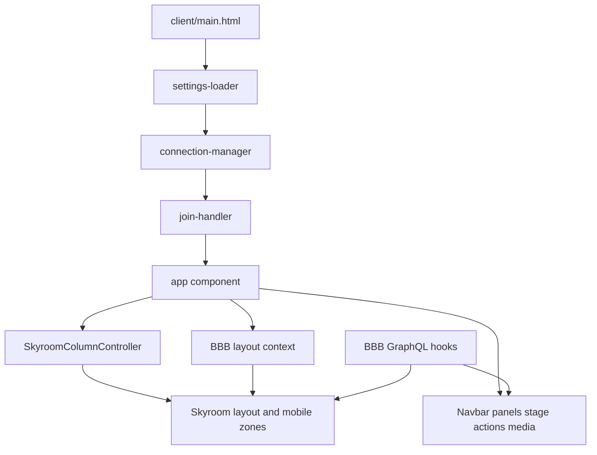

# SafeMeet Meeting UI Architecture

SafeMeet extends the BigBlueButton 3.x HTML5 client. BBB remains the source of truth for meeting lifecycle, layout state, GraphQL, permissions, media, whiteboard, and recording. SafeMeet owns the meeting presentation layer and selected UX adapters.

## Runtime flow



## Primary extension layer

`bigbluebutton-html5/imports/ui/components/skyroom-layout/` owns:

- SafeMeet column-layout controller
- desktop and mobile panel coordination
- mobile bottom tabs and status/talking rails
- shared-notes column presentation
- webcam-zone UX and synchronization adapters
- SafeMeet loading, branding, badges, connection status, chat actions, and poll summary

`bigbluebutton-html5/public/stylesheets/skyroom/` owns:

- design tokens and semantic theme
- layout/stage skin
- navbar, action bar, sidebar, panel, chat, whiteboard, modal, poll, loading, error, and responsive styles

`client/main.html` activates SafeMeet attributes, RTL/Persian defaults, font, and stylesheet order.

## BBB state ownership

### Layout

The layout reducer/context in `imports/ui/components/layout/` remains authoritative. SafeMeet must use `layoutSelect*`, `layoutDispatch`, `ACTIONS`, and `PANELS`.

SafeMeet attributes on `#layout` are rendering hooks derived from authoritative state; they must not become a competing state model.

### Realtime data

Use core hooks under `imports/ui/core/hooks/`, deduplicated subscription infrastructure, and feature-local GraphQL files. The typical flow is:

```text
UI event
→ component/container or service
→ GraphQL mutation/action
→ Redis/Akka/backend handling
→ database view
→ subscription
→ projected React state
```

Trace the complete flow before modifying synchronized behavior.

### Media

Audio, LiveKit/WebRTC, screenshare, and SFU services remain BBB core. SafeMeet may change controls, placement, and visual feedback while preserving transport and publish lifecycles.

### Presentation and whiteboard

Presentation camera and tldraw synchronization remain BBB core. SafeMeet may skin toolbars and adapt layout but must preserve pan/zoom, cursor, slide, and annotation throttles.

## Extension choices

### Preferred

- scoped Skyroom CSS and semantic variables
- new component/hook within `skyroom-layout/`
- existing panel/layout helpers
- small guarded integration using `isSkyroomTheme()`
- BBB plugin extensible areas
- configuration or feature flag
- thin adapter around an existing BBB hook/service

### Higher risk

- editing `layout/context.jsx` or core geometry engines
- editing GraphQL connection/subscription infrastructure
- changing app mount/join order
- changing presentation/whiteboard synchronization
- changing LiveKit/WebRTC/audio bridges
- changing authentication, permissions, or recording contracts

High-risk changes require official BBB documentation, an end-to-end trace, compatibility notes, and stronger multi-client verification.

## Meeting surface map

- shell: `app/component.jsx`
- navbar: `nav-bar/` plus `skyroom-layout/header-logo/`, poll summary, connection widgets
- action dock: `actions-bar/`
- users: `user-list/` plus SafeMeet search/avatar extensions
- chat: `chat/chat-graphql/` plus SafeMeet header/composer/sticker extensions
- notes: `notes/`, `pads/`, `bn-shared-notes/`, SafeMeet notes column
- stage: `presentation/`, `whiteboard/`, `screenshare/`, external video
- webcams: `webcam/`, `video-provider/`, SafeMeet webcam zones
- overlays/modals: BBB common modal primitives plus SafeMeet skins

## Mobile layout model

Phone layout is a SafeMeet split-zone system, not a scaled desktop layout:

- top zone: stage media or webcams depending on active content
- bottom zone: one selected panel such as chat, users, notes, breakout, waiting users, or webcams
- mobile tabs own explicit bottom-zone selection
- status and talking rails are portaled/floating surfaces
- fullscreen state and webcam publishing must keep the required media subtree mounted

New mobile features must define zone ownership, selection behavior, close/fallback behavior, scrolling, and media transitions.

## Performance contracts

- no duplicate subscriptions, stores, polling, or upload paths
- publish only changed effective values
- preserve existing throttles/debounces
- use narrow selectors and projections
- avoid per-frame React state and broad DOM observers
- coalesce layout reads/writes
- treat large user/chat/webcam sets as normal

## Upstream risk classification

- Low: new SafeMeet file, scoped CSS, docs, tests, wrapper, plugin
- Medium: small guarded edit to an upstream component, setting/type extension, feature-local GraphQL addition
- High: core reducer/transport/sync/media/auth/backend-contract change

Plans and reviews should name the classification and explain every medium/high edit.

## Configuration and deployment

Runtime settings originate from `private/config/settings.yml`, server overrides, and meeting create parameters. Do not hardcode a configurable behavior in a component.

Local UI iteration may use `./deploy.sh --only html5`. Branch CI publishes selected Debian packages to the SafeMeet apt repository; it does not deploy source to the old BBB server. See `DEPLOY-FA.md` and `SAFEMEET-BBB-INSTALL-REPO.md`.
