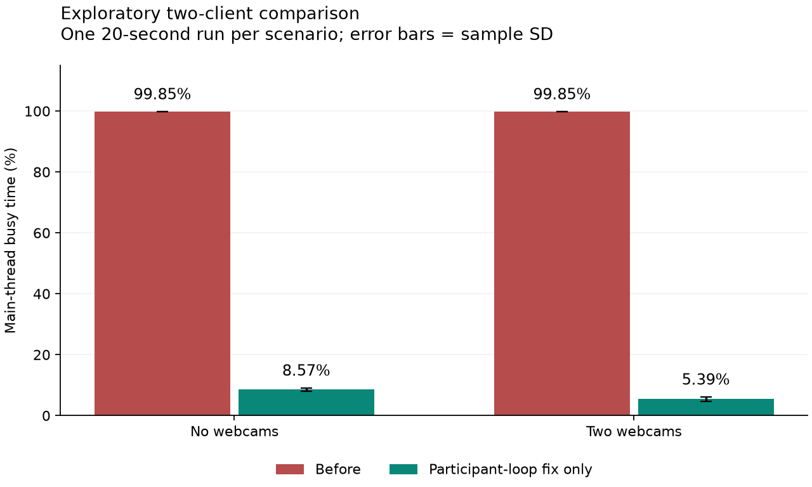

# گزارش بهینه‌سازی عملکرد SafeMeet

تاریخ: ۱۱ سپتامبر ۲۰۲۶ — وضعیت: **برای انتشار مرحله‌ای production به‌صورت نسبی آماده است؛ تبلت واقعی کوتاه‌مدت آزموده شد، اما تضمین دما/باتری گوشی تا آزمون طولانی دستگاه واقعی ممکن نیست.**

یک حلقهٔ رندر مداوم در فهرست کاربران شناسایی و اصلاح شد. در مقایسهٔ کوتاه و هم‌شرایط دوکاربره، اشغال main thread در حالت بدون وبکم از **۹۹٫۸۵٪ به ۸٫۵۷٪** رسید؛ کاهش نسبی حدود **۹۱٫۴٪**. این نتیجه مربوط به main thread و همین آزمایش است، نه کاهش ۹۱٪ مصرف کل دستگاه، دما یا باتری. پروتکل سه تکرارِ پنج‌دقیقه‌ای و آزمون مداوم ۳۰ دقیقه‌ای تکمیل نشده و رسیدن به معیار پذیرش نهایی اعلام نمی‌شود.

تغییرات فقط در workspace هستند. commit، push، استقرار، تغییر تنظیمات backend یا پایان‌دادن جلسه انجام نشده است.

## محیط و نسخه

| مورد | مقدار ثبت‌شده |
|---|---|
| سیستم واقعی | Windows، AMD Ryzen 5 9600X، ۱۲ پردازندهٔ منطقی |
| حافظه | ۳۳٬۴۸۴٬۲۶۳٬۴۲۴ بایت، حدود ۳۱٫۱۸ GiB |
| مرورگر اندازه‌گیری | Chrome 152.0.7977.83 از طریق Playwright موجود مخزن |
| نسخهٔ پایهٔ Git | `82fac060956d5fba92a77f420b05eede2ca96852` |
| کلاینت | build تولیدی محلی، بدون HMR؛ backend مشترکِ سرور مجاز |
| جلسه | همان شناسهٔ توافق‌شده؛ مقدار واقعی و اطلاعات ورود در گزارش درج نشده‌اند |
| نقش‌ها | دو مدیر اول؛ برای اجرای ۱۲ نفره، ده بینندهٔ مستقل |
| دستگاه واقعی Android | Samsung SM-X205، Android 14، Chrome 149، حدود ۳٫۵ GiB RAM؛ آزمون کوتاه تبلت انجام شد |
| دما، مصرف باتری و توان الکتریکی | دمای باتری و thermal status نمونه‌برداری شد؛ مصرف باتری/soak به‌علت شارژ ۳٪ و اتصال USB معتبر نیست |

مرورگر هدف در فرایند مستقل و به‌صورت headed باز شد. مرورگرهای تولید بار headless و مستقل بودند. viewport پیش‌فرض ۱۴۴۰×۹۰۰ و CPU throttle برابر ۱ بود. اجرای ۱۲ مرورگر روی همین میزبان، آزمون بار تجمعی است؛ تنها با نبود اشباع میزبان هم نمی‌توان رفتار یک گوشی واقعی را نتیجه گرفت، چون اشباع سخت‌افزار GPU اندازه‌گیری نشده است.

نام bundleهای مهم برای بازشناسی نتایج:

- پایه: `b867ec6dd890dbb8e056`؛ نسخهٔ کامل dist پایه به‌صورت محلی در `artifacts/performance/baseline-dist` نگهداری شده است.
- فقط اصلاح حلقهٔ کاربران: `b373ac20f393a20702de`.
- نسخهٔ دارای کنترل کیفیت و بازیابی فشار، پیش از استثنای fullscreen: `9b88fd7babf17f2a836b`.
- build نهایی آزمایش‌شده، شامل استثنای fullscreen و semantics ذخیره/لغو تنظیم: `ee0cf29753dab643b6ab`.
- build نهایی این مرحله، شامل سقف سخت decoder و اولویت focused/fullscreen: `425851414bf363373562`.
- build آزمون رفتاری production-ready: `e87aa643dc387e97a745`.
- build تولیدی نهایی پس از تعمیم آزادسازی remote camera در پس‌زمینه به همهٔ tierها: `d820eae9afe4cad534cf`.
- build نهایی آزمون‌شده روی تبلت، شامل اصلاح تشخیص pagination تبلت: `2302052b644dfacb9a08`.

`metadata.json` هر اجرای موفقِ مرحلهٔ ورود، نسخه، پارامترها و در اجراهای جدید نام bundle تمام مرورگرها را ثبت می‌کند. نام فایل‌های قدیمی موجود در dist نشانهٔ استفاده از آن‌ها نیست؛ فایل index و script بارگذاری‌شده ملاک است.

## تنظیمات مؤثر جلسه

تنظیمات از `window.meetingClientSettings` پس از ورود خوانده شدند؛ صرف ویرایش فایل YAML محلی مبنای گزارش نیست. معماری BBB، کلاینت را از backend جلسه و رسانه جدا می‌کند؛ مسیر توسعهٔ رسمی نیز در [راهنمای توسعه BBB](https://docs.bigbluebutton.org/development/guide/) آمده است.

| تنظیم | مقدار مؤثر ثبت‌شده |
|---|---|
| `safemeetPerformance.enabled / mode` | `true / auto` |
| بودجهٔ decoder موبایل / دسکتاپ کم‌توان | ۴ / ۶ |
| آستانهٔ long task | ۲۰۰ میلی‌ثانیه، ۳ مورد در ۳۰ ثانیه |
| آستانهٔ توان دستگاه | concurrency ≤۴ یا deviceMemory ≤۴ GB |
| LiveKit selective subscription | فعال؛ debounce برابر ۲۵۰۰ ms |
| LiveKit adaptiveStream / dynacast | هر دو فعال |
| `singlePeerConnection` | false |
| `stopLocalTrackOnUnpublish` | false |

مقدار `recoveryQuietMs=60000` به فضای موجود تنظیمات اضافه شده است. چون تنظیمات backend هنوز این کلید را نمی‌فرستد، fallback همین مقدار در کلاینت استفاده می‌شود. هیچ تغییر انتشار وبکم روی سرور اعمال نشده است.

## علت اثبات‌شده و اصلاح آن

در `user-list-participants/page/component.tsx`، نتیجهٔ `filterByMeetingId` در هر رندر آرایه‌ای تازه می‌ساخت. این مرجع تازه، محاسبهٔ `displayUsers` و effect ارسال کاربران قابل‌دیدن به والد را دوباره اجرا می‌کرد. effect بدون تغییر محتوای قابل‌نمایش، state جدیدی به والد می‌داد؛ والد دوباره فرزند را رندر می‌کرد. نتیجه، فعالیت تقریباً پیوستهٔ main thread حتی در جلسهٔ بدون وبکم بود.

در پروفایل تشخیصی ده‌ثانیه‌ای، بخش بزرگی از زمان در serialization و hash کوئریِ مسیر subscription دیده شد. این هزینه پیامد تکرار رندرها بود. ابزار تشخیصی React با نگهداری آخرین state واقعی در WeakMap، بیش از ۸۰۰۰ تغییر state مربوط به کاربران قابل‌دیدن را در یک بازهٔ کوتاه ثبت کرد. پروفایل React در اجرای مقایسهٔ عددی خاموش بود.

اصلاح شامل memo کردن فیلتر با وابستگی به دادهٔ کاربران و meetingId، و جلوگیری از انتشار state در صورت یکسان‌بودن ترتیب و مرجع کاربران است. پاک‌سازی صفحه نیز immutable شده است. تغییر واقعی کاربر، مجوز یا ترتیب همچنان منتشر می‌شود. آزمون ۱۰٬۰۰۰ به‌روزرسانی معادل، ثابت‌ماندن مرجع state را بررسی می‌کند؛ آزمون‌های جدا تغییر نقش/ترتیب و پاک‌سازی را پوشش می‌دهند.

فایل کمکی: `bigbluebutton-html5/imports/ui/components/user-list/user-list-content/user-participants/user-list-participants/visible-users.ts`.

هستهٔ GraphQL، hashing subscription، قراردادهای mutation، permission و زمان‌بندی تخته برای این اصلاح تغییر نکردند. پس از حذف حلقه، زمان script در اجرای کوتاه به حدود ۰٫۲٪ رسید؛ شواهدی برای توجیه بازنویسی آن مسیرهای هسته‌ای به دست نیامد.

## تکمیل سازوکار موجود عملکرد

این تغییرات در همان `safemeetPerformance` پیاده شده‌اند؛ store تشخیص فشار یا state موازی اضافه نشده است:

1. شروع observer و listenerها idempotent شد و در stop پاک‌سازی می‌شوند. observer در پس‌زمینه قطع می‌شود.
2. کاهش کیفیت همچنان بر اساس آستانهٔ فشار موجود است؛ بازیابی با یک timer و پس از بازهٔ آرام ۶۰ ثانیه‌ای انجام می‌شود. رخداد سنگین تازه این زمان را عقب می‌اندازد؛ بازگشت فوری و رفت‌وبرگشت سریع کیفیت رخ نمی‌دهد.
3. کنترل فارسی «خودکار / کیفیت معمول» در تنظیمات صرفه‌جویی داده اضافه شد. select بومی، label متصل و دسترسی صفحه‌کلید دارد. انتخاب فقط با دکمهٔ ذخیره اعمال می‌شود؛ لغو یا بستن modal مقدار فعال را تغییر نمی‌دهد. مقدار در همین نشست باقی می‌ماند و با ورود مجدد به پیش‌فرض جلسه برمی‌گردد.
4. حالت کیفیت معمول محدودیت decoder مبتنی بر عملکرد را کنار می‌گذارد. سازوکار معمول adaptive stream خود LiveKit همچنان برقرار است.
5. در مسیر دریافت دوربین LiveKit، tier پایین سقف کیفیت دوربین‌های غیرانتخاب‌شده را MEDIUM می‌کند. اندازهٔ عنصر همچنان در adaptive stream لحاظ می‌شود. تصویر انتخاب‌شده و تمام‌صفحه سقف HIGH دارند. صدا و اشتراک صفحه وارد این سیاست نشده‌اند و تنظیمات ناشر عوض نشده است.

مدیریت موجود وبکم خارج از دید حفظ شده و رخداد تغییر tier به آن متصل شده است؛ ادعای صرفه‌جویی صرفاً بر اساس پنهان‌سازی CSS مطرح نمی‌شود. در بازبینی بار بالا مشخص شد شاخهٔ `visibleRemotes.length > remoteBudget` همهٔ tileهای قابل‌دیدن را دوباره اضافه می‌کرد و سقف decoder را می‌شکست. اکنون سقف واقعاً سخت است: موبایل حداکثر ۴ decoder و دسکتاپ کم‌توان حداکثر ۶ decoder دارد؛ وبکم محلی از بودجه کم می‌شود، focused/fullscreen و pinned اولویت قطعی دارند و هنگام اسکرول فقط یک جریان قبلی به مدت ۱۲۰ ms برای handoff نگه داشته می‌شود. بستن پنل وبکم یا رفتن document به پس‌زمینه، در همهٔ tierهای عملکرد remote cameraها را unsubscribe می‌کند؛ این رفتار دیگر منتظر تشخیص فشار نمی‌ماند. وبکم محلی، صدا و اشتراک صفحه حفظ می‌شوند و هنگام بازگشت انتخاب viewport دوباره ساخته می‌شود. آزمون مستقیم، انتخاب جریان بعدی پس از اسکرول، بازگشت از hidden و باقی‌ماندن focused خارج از viewport را پوشش می‌دهد. **منفعت عددی این سقف در جلسهٔ ۱۲ وبکم به‌علت ناپایداری شبکه کامل نشد.** این بخش نباید با بهبود اثبات‌شدهٔ حلقهٔ کاربران یکی گرفته شود.

## نتایج عددی قابل استناد

داده‌ها و محاسبات در [summary.json](performance-data/summary.json) هستند. نسبت اشغال main thread از اختلاف `TaskDuration` تقسیم بر اختلاف `Timestamp` خود CDP محاسبه می‌شود. CPU فرایندهای مرورگر، در صورت وجود، از اختلاف CPU time و زمان واقعی نمونه‌ها محاسبه شده و بر مبنای یک هسته است. شمارنده‌های تجمعی مستقیماً درصد CPU تلقی نشده‌اند.

### مقایسهٔ کوتاه برای جداسازی اصلاح حلقه

دو مدیر، هدف مدیر دوم، همان viewport و fixture مخزن با ابعاد ۱۶۰×۱۲۰، ۱۰ ثانیه گرم‌شدن و ۲۰ ثانیه نمونه‌برداری، یک اجرا. هر سطر چهار نمونه و سه اختلاف پنج‌ثانیه‌ای دارد.

| سناریو | main thread قبل | پس از اصلاح حلقه | کاهش نسبی تقریبی | CPU کل میزبان قبل / بعد |
|---|---:|---:|---:|---:|
| بدون وبکم | ۹۹٫۸۵٪ | ۸٫۵۷٪ | ۹۱٫۴٪ | ۳۲٫۸۹٪ / ۱۳٫۴۹٪ |
| دو وبکم | ۹۹٫۸۵٪ | ۵٫۳۹٪ | ۹۴٫۶٪ | ۳۱٫۵۹٪ / ۱۱٫۳۷٪ |

در حالت بدون وبکم پس از اصلاح، بازهٔ نمونه‌ها حدود ۸٫۰۳ تا ۹٫۲۹٪ بود؛ با دو وبکم حدود ۴٫۳۴ تا ۶٫۰۸٪. انحراف معیار، تعداد و بازهٔ دقیق در JSON آمده‌اند. این پراکندگی مربوط به نمونه‌های یک اجرای کوتاه است، نه سه تکرار مستقل یا فاصلهٔ اطمینان آماری.

CPU فرایندهای هدف در baseline کوتاه به شکل قابل‌مقایسه ثبت نشده است؛ به همین دلیل کاهش CPU کل فرایند هدف از این جفت داده اعلام نمی‌شود. heap پایانی نیز اثبات نشت یا نبود نشت نیست، چون GC و طول اجرا متفاوت اثر می‌گذارند.

### اجرای ۱۲ کاربر

| اجرا | سناریو | main thread هدف | CPU مرورگر هدف، یک هسته | CPU میزبان | اعتبار |
|---|---|---:|---:|---:|---|
| `baseline-12-v3` | صفر وبکم، ۶۰ ثانیه | ۹۹٫۸۸٪ | ۹۲٫۴۶٪ | تقریباً ۱۰۰٪ | میزبان اشباع؛ فقط فشار تجمعی |
| `supervised-12-v3` | صفر وبکم، ۳۰ ثانیه | ۷٫۳۴٪ | ۲۱٫۰۵٪ | ۳۱٫۲۷٪ | ۱۲/۱۲ حاضر، بدون اشباع ثبت‌شده |
| همان | ۱ وبکم | ۱۱٫۳۹٪ | ۳۵٫۱۶٪ | ۶۰٫۴۰٪ | ۱ ناشر واقعی |
| همان | ۴ وبکم | ۶٫۲۸٪ | ۳۶٫۳۷٪ | ۴۲٫۸۵٪ | ۴ ناشر واقعی |
| همان | ۸ وبکم | ۴٫۱۸٪ | ۳۳٫۰۲٪ | ۵۵٫۲۶٪ | ۸ ناشر واقعی |
| همان | ۱۲ وبکم | ۱۵٫۲۰٪ | ۶۶٫۶۵٪ | ۶۷٫۵۹٪ | ۱۲ ناشر واقعی |
| همان | ۸ وبکم + صفحه | ۱۷٫۲۲٪ | ۶۹٫۳۱٪ | ۷۵٫۶۲٪ | ۸ ناشر و صفحهٔ WebRTC |
| همان | ۱۲ وبکم + صفحه | ۶٫۶۰٪ | ۵۲٫۴۸٪ | ۵۶٫۰۵٪ | ۱۲ ناشر و صفحهٔ WebRTC |
| `acceptance-after-viewer-direct-v6` | صفر وبکم، warm-up ۱۲۰s + سنجش ۳۰۰s | ۱۳٫۳۲٪ | ۳۲٫۴۸٪ | ۴۶٫۹۶٪ | یک تکرار دقیق؛ میزبان اشباع نشد |

در `supervised-12-v3`، API در هر هفت مرحله حضور ۱۲ کاربر آزمایشی، ۲ مدیر و تعداد ناشران ۰/۱/۴/۸/۱۲ را تأیید کرد. این اجرای کوتاه روی build نهایی بود، ولی در انتهای تست تخته dependency محلی خارج شد؛ بنابراین فقط پنجره‌های عددیِ کامل‌شده استفاده شده‌اند. نامعتبرشدن بخش تعاملی به داده‌های قبلی سناریوها تعمیم داده نشده و در raw data مشخص است.

در v6، پنجرهٔ پنج‌دقیقه‌ای پایه ۶۰ نمونه داشت: main thread میانگین ۱۳٫۳۲٪، p95 برابر ۲۱٫۲۸٪ و انحراف معیار ۵٫۷۷؛ CPU مرورگر هدف میانگین ۳۲٫۴۸٪ و p95 برابر ۴۶٫۲۱٪ از یک هسته؛ CPU میزبان میانگین ۴۶٫۹۶٪ و p95 برابر ۶۳٫۸۲٪. heap از ۳۳٫۰۸ به ۳۴٫۰۱ MiB رسید و listener از ۱۸۱۶ به ۱۸۹۵ تغییر کرد؛ یک پنجره برای حکم نشت کافی نیست. پس از warm-up مرحلهٔ یک وبکم، API هنوز ۱۲ کاربر را دید ولی ناشر واقعی از ۱ به ۰ برگشته بود، بنابراین اجرا متوقف شد و تکرارهای بعدی و soak انجام نشدند.

مقایسهٔ مستقیم درصد بهبود baseline دوازده‌مرورگر با اجراهای نهایی مجاز نیست، چون baseline میزبان را اشباع کرده است. معیار ۲۰٪ فقط در جفت کوتاه و هم‌شرایطِ جداسازی حلقه عبور کرده است. همچنین ترتیب غیر یکنواخت CPU بین ۸ و ۱۲ وبکم نشان می‌دهد اجراهای ۳۰ ثانیه‌ای برای برآورد پایدار هزینهٔ رسانه کافی نیستند.

در اتصال محلی به live51، GraphQL و media WebSocket با کد 1006 به‌طور مکرر قطع و دوباره برقرار شدند. بررسی خواندنی سرور نشان داد `bbb-graphql-middleware` فعال، بدون restart و با load پایین بود؛ nginx اتصال‌های GraphQL را با 101 پذیرفته بود. مسیر SSH tunnel نیز از سمت میزبان بسته شد و مسیر مستقیم GraphQL به‌دلیل سیاست Origin وارد UI نشد. این شواهد محل دقیق قطع را اثبات نمی‌کند، اما نشان می‌دهد تکمیل پروتکل طولانی با توپولوژی فعلی قابل اتکا نیست. source map خطای `Cannot read properties of undefined (reading 'public')` را به `audio-manager/index.js:152` در handler قدیمی `beforeunload` نگاشت؛ دسترسی این handler به تنظیمات اکنون guard شده تا unload/reconnect خطای ثانویه تولید نکند. خطای `Failed to fetch` نیز به fetch ارائه در `presentation/container.jsx:224` نگاشت شد و بهینه‌سازی این مرحله آن مسیر را تغییر نداد.

### مرحلهٔ بار بالاتر، ۲۵ تا ۵۰ کاربر

در این مرحله هستهٔ جلسه، GraphQL، SFU، صدا، وبکم و اشتراک صفحه روی `live51` اجرا شدند. سیستم محلی فقط build تولیدی HTML5، پراکسی loopback و browserهای مستقل Playwright را اجرا کرد. دو کاربر اول مدیر و متصل به صدا بودند؛ کاربران دیگر برای جدا نگه‌داشتن سناریوی ۵۰ وبکم از شکست echo/audio فقط بار UI، GraphQL و ویدئو را تولید کردند. جلسهٔ موجود پایان داده نشد.

| تلاش | بیشترین وضعیت تأییدشده | نتیجه |
|---|---|---|
| ۲۵ کاربر، batch سه‌تایی | هر ۲۵ browser باز شد؛ API در نقطهٔ کنترل ۲۱ کاربر را دید | نامعتبر؛ حضور کامل پیش از رسانه پایدار نماند |
| ۲۵ کاربر، audio فقط دو مدیر | RAM آزاد محلی پس از ورود: ۱۰٫۴ GiB؛ API: ۲۱/۲۵ | نامعتبر؛ کمبود RAM رخ نداد، قطع GraphQL/تنظیمات رخ داد |
| ۱۸ کاربر، ورود پنج‌تایی | RAM آزاد محلی: ۱۴٫۳ GiB؛ API پس از warm-up: ۱۱/۱۸ | نامعتبر؛ افت حضور، بدون اشباع `live51` |
| ۱۲ کاربر، دسکتاپ | مرحلهٔ صفر وبکم: ۱۲/۱۲ و ۱۲۰ ثانیه اندازه‌گیری | معتبر برای صفر وبکم؛ مرحلهٔ ۱۲ وبکم به ۹ کاربر و صفر publisher افت کرد |
| ۸ کاربر، publish هم‌زمان | حضور ۸/۸؛ فقط ۱/۸ publisher در API | نشان داد publish هم‌زمان ابزار قابل اتکا نیست |
| ۸ کاربر، publish ترتیبی | شش publisher واقعی و پنج ویدئوی ورودی روی هدف؛ دوربین هفتم timeout | شاهد رسانه تا شش وبکم؛ سناریو پیش از پنجرهٔ عددی کامل شد |
| ۶ کاربر، publish ترتیبی | هر ۶ کاربر وارد شدند؛ دوربین مدیر اول پس از چند reconnect timeout | نامعتبر به‌علت نوسان اتصال |
| ۱۲ کاربر از SSH tunnel | شش کاربر وارد شدند | tunnel از سمت میزبان بسته و supervisor اجرا را نامعتبر کرد |

در اجرای تازهٔ معتبر ۱۲ کاربر بدون وبکم، main thread هدف میانگین **۱۵٫۲۵٪**، CPU فرایند هدف **۳۳٫۲۳٪ از یک هسته** و CPU میزبان **۵۶٫۷۲٪** بود؛ p95ها به‌ترتیب ۲۶٫۲۰٪، ۵۲٫۷۳٪ و ۷۰٫۹۱٪ بودند. میزبان طبق آستانهٔ ۸۵٪ اشباع نشد. CPU هر نشست مستقل در همین پنجره بین **۲۵٫۰۲٪ تا ۴۰٫۶۷٪ از یک هسته** میانگین داشت. رشد listener از ۱۷۶۵ به ۲۷۶۸ در این پنجره همراه reconnectهای مکرر رخ داد و به‌تنهایی اثبات نشت نیست.

در اجرای هشت‌کاربرهٔ صفر وبکم، CPU میانگین نشست‌ها بین **۳۸٫۶۳٪ تا ۴۷٫۶۲٪ از یک هسته** و private bytes پایانی هر Chrome مستقل بین **۶۴۶ تا ۷۱۹ MiB** بود. این اعداد شامل renderer، network، GPU و utility process همان browser هستند؛ مجموع Working Set صفحات اشتراکی را چندبار می‌شمارد. افزایش CPU نسبت به اجرای ۱۲ نفره با reconnectها و کوتاهی پنجره سازگار است و برای مدل مقیاس‌پذیری خطی استفاده نمی‌شود.

در تلاش ترتیبی هشت‌نفره، پیش از timeout دوربین هفتم، هدف پنج ویدئوی ورودی 480×270 را با ۱۴ تا ۲۰ fps دریافت کرد؛ RTT candidate pair حدود ۲۳ تا ۵۶ ms بود و packet loss ویدئو در نمونهٔ پایان شکست صفر ثبت شد. freezeهای اولیه بین ۳ تا ۶ مورد بودند، اما چون جریان‌ها به‌تدریج اضافه شدند و پنجرهٔ پایدار آغاز نشد، نرخ freeze پذیرفته‌شده اعلام نمی‌شود.

پایش read-only `live51` در تلاش‌های بار بالا هیچ restart در nginx، `bbb-graphql-middleware` یا `bbb-webrtc-sfu` نشان نداد. در تلاش دوم ۲۵ کاربر، CPU کل سرور میانگین **۳٫۲۸٪** و p95 برابر **۴٫۹۲٪**، RAM آزاد میانگین **۱۰٫۴۸ GiB**، CPU GraphQL میانگین **۲٫۶۱٪ از یک هسته** و CPU SFU میانگین **۲٫۱۷٪ از یک هسته** بود. در تلاش دارای شش publisher، CPU SFU میانگین ۶٫۱۸٪ و بیشینه ۱۴٫۴۱٪ از یک هسته و حافظهٔ آن حدود ۴۵۰ MiB بود. اتصال SSH مانیتور نیز گاهی قطع شد؛ summary فاصله‌های reconnect را در محاسبهٔ delta کنار می‌گذارد و نسبت نمونه‌های در دسترس را ثبت می‌کند.

با این زیرساخت، **سقف تازهٔ معتبر برای حضور کامل هشت کاربر و برای رسانهٔ واقعی شش publisher پیش از شکست بود**. این عدد ظرفیت SafeMeet یا `live51` نیست؛ محدودیت مولد بار و مسیر شبکهٔ این آزمایش است. اجرای موفق پیشین `supervised-12-v3` همچنان قوی‌ترین شاهد این workspace برای ۱۲/۱۲ وبکم و اشتراک صفحه است. ادعای ۵۰ کاربر، آزمون طولانی موبایل یا بی‌فشاربودن دستگاه ضعیف از این مرحله ساخته نمی‌شود.

اصلاحات زیرساختی این مرحله شامل گزارش CPU/RAM هر browser، پایش عددی host/GraphQL/SFU روی `live51` با reconnect خودکار، retry امن API/SSH، افزایش تدریجی رسانه، و توقف ایمن در سه نمونهٔ پیاپی CPU≥۹۷٪ یا RAM آزاد کمتر از ۱ GiB است. یک اصلاح محصول نیز پس از مشاهدهٔ نقض بودجه پذیرفته شد: شاخه‌ای که هنگام زیادبودن tileهای قابل‌دیدن سقف decoder را دور می‌زد حذف و focused/fullscreen وارد اولویت انتخاب شد. این اصلاح تعداد ناشران را تغییر نمی‌دهد و فقط subscription دریافت‌کنندهٔ کم‌توان را محدود می‌کند.

خطای ثانویهٔ `audio-manager/index.js:152` نیز با optional access برطرف شد. در unload ناشی از قطع شبکه ممکن بود `meetingClientSettings` قبلاً پاک شده باشد؛ اکنون cleanup صوت بدون throw انجام می‌شود. قرارداد صوت، bridge و رفتار confirmation تغییر نکرده است.

## آزمون‌های رفتاری و رگرسیون

اجرای نهایی `interaction-final-ee0` با دو مدیر و یک بیننده، روی bundle `ee0cf29753dab643b6ab`:

| آزمون | نتیجه |
|---|---|
| ارسال چت فارسی و نمایش در گیرنده | موفق؛ latency مشاهده‌شده ۴۰۸ ms؛ فقط پیام خود آزمون حذف شد |
| رسم پنج خط و مشاهده در گیرنده | موفق؛ ۱۱۵، ۳۸۳، ۳۷۰، ۳۸۶ و ۱۱۸ ms؛ annotation گم‌شده صفر |
| undo همان پنج خط | موفق؛ تعداد شکل‌ها به مقدار پیش از آزمون برگشت |
| اشتراک صفحهٔ متنی و متحرک | موفق؛ دریافت ۱۲۸۰×۷۲۰ و پیشرفت زمان از ۳٫۹۸۳ به ۸٫۸۴۳ ثانیه |
| حالت کیفیت در ۳۹۰، ۷۶۸، ۱۴۴۰ | موفق؛ فارسی RTL و بدون overflow افقی |
| کار با صفحه‌کلید و لغو | موفق؛ تغییر ذخیره‌نشده اعمال نشد |
| قطع شبکهٔ هدف و بازگشت | موفق؛ فریم دریافتی از ۴۵۱ به ۴۷۵ رسید |
| fullscreen وبکم و خروج | موفق؛ تصویر پس از ورود و خروج بازیابی شد |
| چرخهٔ پنل‌ها | موفق؛ PeerConnection از ۶ به ۶ ثابت و DOM از ۷۲۱ به ۶۸۹ رسید |

پس از اصلاح سقف سخت، smoke تازهٔ `strict-budget-smoke3-v1` روی bundle `425851414bf363373562` نیز موفق بود: ۳/۳ کاربر و ۳/۳ publisher در هر دو مرحلهٔ وبکم و وبکم+صفحه تأیید شدند و failure صفر بود. در مرحلهٔ وبکم، main thread هدف ۱٫۸۸٪ و CPU هدف ۲۰٫۹۹٪ از یک هسته بود؛ دو ویدئوی ورودی با ۱۵ fps و بدون frame drop رسیدند. با اشتراک صفحه، main thread ۶٫۰۹٪ و CPU هدف ۳۴٫۷۲٪ شد؛ دو وبکم و صفحهٔ 1280×720 دریافت شدند و frame drop صفر بود. این smoke رگرسیون انتشار و صفحه را رد می‌کند، ولی اثبات صرفه‌جویی cap در بار ۱۲/۵۰ وبکم نیست.

روی bundle نهایی `e87aa643dc387e97a745` نیز `production-ready-smoke3-v1` اجرا شد: هر دو مرحله ۳/۳ کاربر و ۳/۳ publisher داشتند؛ وبکم، صفحهٔ 1280×720، reconnect و پیشرفت فریم، fullscreen، lifecycle پنل‌ها، کنترل فارسی در ۳۹۰/۷۶۸/۱۴۴۰ و تخته بدون annotation گم‌شده موفق بودند. main thread هدف در مرحلهٔ سه وبکم ۱۰٫۲۴٪ و در مرحلهٔ ترکیبی ۶٫۸۳٪ بود؛ میزبان اشباع نشد. chat-sync در این اجرا fail شد و نخستین annotation حدود ۱۱ ثانیه تأخیر داشت؛ هم‌زمان ۳۲ بسته‌شدن/خطای WebSocket ثبت شد. چون مسیرهای chat و whiteboard در این اصلاح تغییر نکرده‌اند و اجرای پایدار قبلی آن‌ها را موفق دیده بود، این نتیجه به ناپایداری اتصال نسبت داده شده، اما از گزارش حذف نشده است.

### آزمون تبلت واقعی Android

تبلت Samsung SM-X205 با Android 14 و Chrome 149 از طریق ADB/CDP به build محلی و جلسهٔ `live51` متصل شد. viewport مؤثر Chrome برابر 1280×680 با DPR=1.5 بود؛ بنابراین SafeMeet ظاهر دسکتاپ را نمایش می‌داد، هرچند BBB به‌علت Android User-Agent endpoint را mobile تشخیص می‌داد.

در اجرای `android-webcam-visibility-smoke5` چهار publisher واقعی و مستقل روی `live51` تأیید شدند، اما تبلت فقط دو tile مدیرها را در DOM داشت. علت، استفادهٔ هم‌زمان از `mobilePageSizes.viewer = 2` و layout دسکتاپ SafeMeet بود؛ این ترکیب صفحهٔ وبکم را به دو مورد محدود می‌کرد، در حالی که کنترل grid موبایل در این viewport فعال نبود. انتخاب page-size اصلاح شد تا SafeMeet فقط در viewport موبایل و column layout از mobile page size استفاده کند. BBB خارج از تم SafeMeet رفتار mobile قبلی را حفظ می‌کند.

روی build `2302052b644dfacb9a08` و اجرای `android-tablet-pagination-fix`، حضور چهار publisher و failure صفر ثبت شد. هر چهار tile شامل دو مدیر و دو بیننده هم‌زمان در DOM و viewport حضور داشتند. هر چهار جریان با 480×270، `readyState=4` و پیشرفت فریم دریافت شدند. در سه نمونهٔ پایدار پنج‌ثانیه‌ای، CPU مجموع پردازش‌های Chrome طبق `adb ps` میانگین **۸۷٫۹٪ از مقیاس یک هسته** و p95 برابر **۸۸٫۱٪** بود؛ PSS میانگین **۱۷۵٫۷۲ MiB**، main-thread میانگین **۱۶٫۶۵٪** و p95 برابر **۱۷٫۸۴٪**، frame drop نهایی **۱٫۶۶٪**، دمای باتری **۳۱٫۹°C** و بیشینهٔ thermal status برابر صفر بود. این درصد CPU برابر ۸۷٫۹٪ کل دستگاه چند‌هسته‌ای نیست.

یک اجرای کوتاه قبلی نیز دریافت هم‌زمان دو وبکم 640×360 و اشتراک صفحهٔ 1280×720 را با پیشرفت فریم تأیید کرد. دو تلاش بعدی مرحلهٔ ترکیبی به‌علت افت publisher و یک خطای مجوز `ExternalVideoStop` از معیار عددی کنار گذاشته شدند و در داده‌های خام باقی مانده‌اند. باتری هنگام آزمایش فقط ۳٪ و دستگاه USB-powered بود؛ بنابراین این آزمایش برای نرخ تخلیهٔ باتری، افزایش دمای طولانی یا soak معتبر نیست.

### آزمون گوشی واقعی Android

گوشی Xiaomi 24117RN76G با Android 16 و Chrome 152 از طریق ADB/CDP به build تولیدی محلی `cdd8bea2e1976c9dd5bf` و جلسهٔ فعال روی `live51` متصل شد. viewport مؤثر `384×742` با DPR برابر 2.8125 بود و SafeMeet وارد layout واقعی موبایل شد.

در تب چت، سیاست موجود موبایل دریافت و decode وبکم‌های خارج از پنل را متوقف کرد و تعداد video element برابر صفر بود. پس از فعال‌کردن تب وبکم، هر سه tile شامل دو مدیر و یک بیننده هم‌زمان در DOM و viewport حضور داشتند. هر سه جریان طی 84.3 ثانیه پیشرفت کردند؛ ابعاد دریافتی بین 480×270 و 640×360 تطبیق یافت، افت فریم تجمعی 1.94٪ بود، PSS میانگین 251.58 MiB و بیشینهٔ آن 252.46 MiB ثبت شد. heap مرورگر از 35.73 به 33.57 MiB رسید و بیشینهٔ 36.11 MiB داشت؛ در این بازه رشد حافظه مشاهده نشد. زمان main thread برابر 23.24٪، script برابر 3.17٪ و layout برابر 0.01٪ بازه بود. CPU مجموعهٔ پردازش‌های Chrome طبق مقیاس `adb ps` میانگین 75.91٪ و p95 برابر 76.7٪ از مقیاس یک هسته بود. دمای باتری بین 35.8 و 36.5°C و thermal status صفر ماند.

در اجرای ترکیبی سه وبکم و اشتراک صفحه، صفحهٔ 1280×720 و یک وبکم پیوسته فریم گرفتند، اما دو publisher مصنوعی پس از شروع ثابت ماندند. همین توقف در گیرندهٔ دسکتاپ نیز ثبت شد؛ بنابراین این اجرا برای رد یا قبول عملکرد ترکیبی موبایل معتبر محسوب نشده و دادهٔ آن به‌عنوان نتیجهٔ ناقص نگهداری شده است. اجرای جداگانهٔ دووبکم+صفحه در مولدهای دسکتاپ failure نداشت، ولی هم‌پوشانی نمونهٔ گوشی برای نتیجهٔ عددی کافی نبود. هیچ کاهش تازه‌ای در تعداد وبکم‌های قابل‌نمایش یا کیفیت انتشار اعمال نشد، چون آزمون سه‌وبکمی پایدار چنین تغییری را توجیه نکرد.

سه اشکال قابل‌بازتولید در این مرحله اصلاح شد: cleanup صدای خروج هنگام حذف‌شدن زودتر تنظیمات جلسه دیگر throw نمی‌کند؛ ابزار Android پیش از ورود فقط تب‌های آزمایشی قدیمی را می‌بندد و تب فعال را برای CDP انتخاب می‌کند؛ و نام کاربران داخل tile وبکم با `dir="auto"` جهت مناسب فارسی یا لاتین را می‌گیرد. ابزار مانیتور همچنین می‌تواند تب وبکم موبایل را در سناریوی رسانه فعال کند و پس از پایان بدون بستن Chrome گوشی خارج شود.

گوشی در تمام اجراها با USB تغذیه می‌شد؛ بنابراین نرخ تخلیهٔ باتری، افزایش دمای طولانی و soak حرارتی هنوز تأیید نشده‌اند. این آزمون کوتاه، دریافت واقعی سه وبکم، رفتار پنل موبایل، پایداری کوتاه حافظه و نبود throttling حرارتی را تأیید می‌کند.

### حالت تطبیقی دستگاه‌های پایین‌رده

حفاظت تطبیقی در فضای موجود `safemeetPerformance` اضافه و در ۱۲ سپتامبر ۲۰۲۶ بنا به درخواست محصول با `adaptiveProtectionEnabled: true` و `mode: auto` فعال شد. خاموش‌کردن همین کلید مسیر تشخیص و بودجهٔ قبلی SafeMeet را برمی‌گرداند. عرض موبایل و `saveData` به‌تنهایی دستگاه را پایین‌رده اعلام نمی‌کنند. حافظهٔ گزارش‌شدهٔ حداکثر ۲ GiB یا حداکثر دو پردازندهٔ منطقی یک نشانهٔ قوی است؛ حافظهٔ حداکثر ۴ GiB فقط همراه با حداکثر چهار پردازندهٔ منطقی مرحلهٔ اولیهٔ کاهش کیفیت را فعال می‌کند.

حالت auto بعد از ۲۰ ثانیه warm-up، main thread را در همان observer و timer پروفایل عملکرد با فاصلهٔ پنج ثانیه می‌سنجد. سه نمونه با اشغال long-task حداقل ۲۰٪ مرحله را یک پله بالا می‌برند؛ مرورگر فاقد Long Task API از lag حداقل ۲۰۰ ms استفاده می‌کند. بازیابی پس از ۱۲ نمونهٔ آرام و هر بار فقط یک مرحله انجام می‌شود. بازگشت از پس‌زمینه و reconnect ده ثانیه warm-up تازه می‌گیرند. حالت دستی کم‌مصرف از سقف سه ویدئو شروع می‌شود و حالت کیفیت معمول مداخلهٔ تطبیقی را در همان نشست کنار می‌گذارد.

مراحل رسانه به‌ترتیب `none`، `quality`، `moderate` و `high` هستند. مرحلهٔ quality فقط سقف دریافت وبکم‌های غیرانتخاب‌شده را به `MEDIUM` می‌رساند. moderate حداکثر سه و high حداکثر دو ویدئوی وبکم فعال نگه می‌دارند؛ تصویر محلی داخل بودجه و همیشه محفوظ است و اشتراک صفحه و صدا وارد این سقف نمی‌شوند. پس از تصویر محلی، انتخاب صریح/fullscreen، مدرس یا ارائه‌دهنده و مدیران، pin و گوینده اولویت دارند. انتخاب صریح می‌تواند یک جایگاه remote را بدون عبور از سقف جابه‌جا کند. هنگام تعویض، حداکثر یک جریان قبلی تا اولین فریم سالم جریان تازه یا دو ثانیه نگه داشته می‌شود. tile تعلیق‌شده آواتار و دکمهٔ قابل‌فوکوس «برای نمایش این وبکم انتخاب کنید» دارد. تغییر مرحله از Toast استاندارد جلسه برای اعلام علت محدودیت و سقف فعلی استفاده می‌کند؛ Toast پس از پنج ثانیه خودکار بسته می‌شود، ضربدر واقعی و قابل‌فوکوس دارد و تا تغییر بعدی مرحله تکرار نمی‌شود.

روی گوشی Xiaomi متصل، حالت auto فعال با `deviceMemory=8` و `hardwareConcurrency=8` در `stage=none` و `tier=standard` ماند؛ بنابراین ظاهر موبایل باعث محدودسازی نشد. فشار کنترل‌شدهٔ main thread پس از سه نمونه مرحله را به quality و پس از سه نمونهٔ بعد به moderate برد. پس از توقف فشار و پنجرهٔ آرام ۶۰ ثانیه‌ای، مرحله فقط به quality برگشت. در رابط فارسی، هر سه انتخاب «خودکار / حالت کم‌مصرف / کیفیت معمول»، متن وضعیت و تغییر دستی به standard بررسی شدند؛ تغییر به standard بلافاصله `stage=none` و `tier=standard` ایجاد کرد.

baseline واقعی چهار وبکم پیش از فعال‌سازی حفاظت، ۸۴٫۱ ثانیه فریم پیوسته از هر چهار جریان داشت: CPU میانگین Chrome برابر ۷۸٫۷۹٪ و p95 برابر ۸۶٫۷٪ از مقیاس یک هسته، PSS میانگین ۲۷۲٫۹۲ MiB و main thread برابر ۲۲٫۶۲٪ بود. تلاش مقایسه‌ای کم‌مصرف پذیرفته نشد، چون runner در دو دور مستقل فقط دو publisher واقعی را نگه داشت و خطای «Actual test publishers do not match requested cameras» ثبت کرد. در نتیجه هدف کاهش ۲۰٪ CPU/main-thread برای این قابلیت هنوز اندازه‌گیری نشده و از آزمون مصنوعی فشار چنین ادعایی ساخته نمی‌شود.

تست‌های خالص با ۵۰ و ۲۰۰ جریان، سقف سه/دو تصویر، حفظ focused، اولویت مدیر/مدرس پس از تصویر محلی، احتساب تصویر محلی، کاهش بودجه هنگام snapshot خالی و جلوگیری از retained قدیمی بیش از سقف را تأیید کردند. TypeScript، lint مرتبط، build تولیدی `06cabe646125ae420838`، تست‌های viewport/playback و تست‌های مجوز و صف تخته موفق بودند. تغییر GraphQL، انتشار دوربین، ضبط، صدا یا زمان‌بندی تخته انجام نشد.

پس از فعال‌سازی پیش‌فرض، یک اجرای واقعی production-client روی همین سیستم با دو نشست مستقل و backend روی live51 انجام شد. تنظیم مؤثر `adaptiveProtectionEnabled=true` و `mode=auto` بود. مرورگر هدف با hintهای ۳۲ GiB و ۱۲ پردازندهٔ منطقی در تمام شش نمونهٔ ۳۰ ثانیه‌ای روی `stage=none` و `tier=standard` ماند و اعلان کم‌مصرف نشان داده نشد؛ بنابراین دستگاه عادی صرفاً با روشن‌شدن قابلیت محدود نشد.

گوشی Android متصل با hintهای ۸ GiB و ۸ پردازندهٔ منطقی نیز در اجرای عادی ۳۵ ثانیه‌ای روی `none/standard` ماند. با long-task کنترل‌شده، مراحل مشاهده‌شده `none → quality → moderate → high` بودند و پس از توقف فشار و ۶۰ ثانیه آرامش، بازیابی یک‌مرحله‌ای `high → moderate` رخ داد. اعلان فارسی مرحلهٔ high روی خود صفحه قابل مشاهده بود و سقف دو وبکم را اعلام کرد. در تکرار سه publisher واقعی، API هر سه publisher را تأیید کرد و گوشی در مرحلهٔ high دقیقاً دو ویدئو، هر دو متعلق به دو مدیر/ارائه‌دهنده، دریافت کرد؛ کاربر عادی جایگاه decoder نگرفت. Toast جدید نیز روی همان گوشی بررسی شد: ضربدر ۳۲×۳۲ و برچسب فارسی داشت، بستن دستی موفق بود، خودکار در بازهٔ پنج‌ثانیه‌ای بسته شد و پس از ۱۲ ثانیه بدون تغییر مرحله تکرار نشد. این آزمون detector، سقف، اولویت و چرخهٔ اعلان را تأیید می‌کند، اما long-task مصنوعی معیار عملکرد یا دمای گوشی پایین‌رده نیست.

fixture صفحه شامل متن فارسی/انگلیسی و بلوک متحرک بود و از `canvas.captureStream` وارد مسیر واقعی LiveKit/WebRTC شد. این آزمون خوانایی و پیشرفت فریم داخل برنامه را پوشش می‌دهد، ولی picker اشتراک صفحهٔ سیستم‌عامل را نمی‌آزماید. تعداد نمونه‌های latency برای تأیید شرط «صدک ۹۵ حداکثر ۱۰٪ بدتر» کافی نیست و baseline هم‌شرایط آن تکمیل نشده است. در تست طولانی v6، صوت ورودی target پس از قطع‌های مکرر media/GraphQL پایدار نماند؛ بنابراین تداوم صوت در پذیرش طولانی **رد شده/تأییدنشده** است، هرچند تست reconnect سه‌کاربره موفق بود.

بررسی‌های کد انجام‌شده:

- TypeScript با `--noEmit`: موفق روی تغییرات نهایی.
- ESLint نه فایل فرانت‌اند مرتبط: بدون error؛ ۱۴ warning قدیمی prop-types در `settings/component.jsx` باقی است.
- تست جدید پایداری state، تغییر واقعی کاربر و ترتیب، cleanup immutable، آستانهٔ فشار، تأخیر بازیابی، mode و lifecycle: موفق.
- تست‌های موجود `annotation-sender`، `shape-permissions`، `mobile-webcam-viewport-utils` و `video-playback-utils`: هر چهار فایل موفق.
- build تولیدی نهایی `2302052b644dfacb9a08`: موفق با هشدار حجم asset/entrypoint. تست تبلت چهاروبکمی روی همین build انجام شد. تست واحد جدید حالت «Android endpoint + SafeMeet desktop tablet layout» را پوشش می‌دهد. هشدارهای اندازهٔ bundle با این اصلاح رفع نشده‌اند.

این تست‌های ماژولی جایگزین آزمون چندکاربرهٔ کامل نیستند. شمارندهٔ listener پیش از اصلاح به‌شدت نوسان می‌کرد و پس از اصلاح در تست کوتاه بسیار کمتر شد، اما این داده به‌تنهایی اثبات نبود نشت listener/subscription/track در چرخه‌های طولانی نیست.

## پوشش برنامه و موارد باز

| الزام | وضعیت |
|---|---|
| اجرای محلی با backend مشترک و تولید بدون HMR | انجام‌شده |
| ۲ مدیر و ۱۰ بینندهٔ مستقل | در اجرای کوتاه همهٔ مراحل با شمارش API تأیید شد؛ v6 نیز ۱۲/۱۲ داشت |
| صفر، ۱، ۴، ۸، ۱۲ وبکم، سه بار قبل و بعد | همهٔ سطوح یک بار کوتاه پس از اصلاح اجرا شد؛ سه تکرار قبل/بعد ناقص |
| ۲ دقیقه گرم‌شدن + ۵ دقیقه سنجش ×۳ | یک پنجرهٔ کامل پنج‌دقیقه‌ای پس از اصلاح انجام شد؛ تکرارهای بعدی با افت ناشر متوقف شد |
| فشار ترکیبی و تست ۳۰ دقیقه‌ای | ۸/۱۲ وبکم + صفحه کوتاه انجام شد؛ soak سی‌دقیقه‌ای به مرحلهٔ اجرا نرسید |
| ۵۰ کاربر، ۵۰ وبکم و صفحه | شروع نشد؛ rampهای ۲۵ و ۱۸ حضور کامل را حفظ نکردند و ادامه با ۵۰ از نظر اعتبار/ظرفیت مولد بار رد شد |
| مصرف هر نشست مستقل | در summary جدید آرایهٔ `sessions` شامل نقش، CPU و RAM هر Chrome است؛ پنجره‌های معتبر ۸ و ۱۲ کاربر موجود است |
| منابع `live51` | host، GraphQL و SFU با فاصلهٔ ۱۰ ثانیه ثبت و deltaهای معتبر محاسبه شدند؛ restart مشاهده نشد |
| نقش هدف مدیر و بیننده | هر دو در اجراهای کوتاه حضور داشته‌اند؛ مقایسهٔ کامل نقش‌ها انجام‌نشده |
| عرض‌های ۳۹۰/۷۶۸/۱۴۴۰ و فارسی RTL | کنترل تنظیمات بررسی شد؛ تبلت واقعی با viewport مؤثر ۱۲۸۰×۶۸۰ نیز بررسی و ناسازگاری pagination آن اصلاح شد |
| CPU throttle چهار و شش برابر | قابل تنظیم؛ نتایج مقایسه‌ای انجام‌نشده |
| تخته: draw/undo | تست چندکاربرهٔ کوتاه موفق |
| اسلاید، zoom/pan، یادداشت، واکنش، تغییر ارائه‌دهنده | پوشش کامل رفتاری انجام‌نشده |
| fullscreen و بازیابی وبکم | روی build نهایی موفق؛ اسکرول و بازگشت از پس‌زمینهٔ واقعی کامل نیست |
| سقف ۵۰ دوربین در منطق انتخاب | تست مستقیم: موبایل ۳ remote + local و دسکتاپ کم‌توان ۵ remote + local؛ focused حفظ شد |
| پنل بسته/پس‌زمینه و بازگشت | unsubscribe و انتخاب مجدد در تست policy موفق؛ تست گوشی واقعی بعداً انجام می‌شود |
| CPU مرورگرها، heap، long task، layout و RTC | نمونه‌برداری موجود؛ برخی اجراهای اولیه فاقد CPU فرایندها |
| RAM فرایندها، CPU سرور محلی و GPU ویندوز | ابزار و بخشی از نمونه‌ها موجود؛ native counter در بخشی از v6 شکست خورد و نبود داده صفر نیست |
| نبود رشد تجمعی منابع و روند حافظهٔ طولانی | تأییدنشده |
| تبلت واقعی و دما | آزمون کوتاه چهار وبکم و یک آزمون ترکیبی انجام شد؛ thermal status صفر ماند، اما soak/باتری به‌علت شارژ ۳٪ و USB نامعتبر است |
| گوشی واقعی و layout موبایل | انجام شد؛ سه وبکم واقعی WebRTC طی 84.3 ثانیه با افت فریم 1.94٪، حافظهٔ پایدار و thermal status صفر تأیید شد؛ آزمون ترکیبی کامل به‌علت توقف publisher مصنوعی همچنان ناقص است |
| حفاظت تطبیقی پایین‌رده | منطق، UI، افزایش مرحله و بازیابی روی گوشی تأیید شد؛ مقایسهٔ عددی چهار وبکم به‌علت افت publisherهای مولد بار نامعتبر ماند |

هدف ۲۰٪ در آزمایش اکتشافیِ بهینه‌سازی‌های قبلی main thread عبور کرده است؛ این نتیجه به قابلیت تطبیقی جدید نسبت داده نمی‌شود. **پذیرش عددی قابلیت تطبیقی** به‌دلیل افت publisherهای مولد بار و نبود مقایسهٔ هم‌شرایط هنوز محقق نیست. منطق سقف کیفیت و subscription در تست‌های خالص و آزمون رفتاری تأیید شده، اما سنجش مستقل منفعت آن به اجرای معتبر بعدی نیاز دارد.

## بازتولید، داده‌ها و بازگشت

دستورها، متغیرهای محیطی، محدودیت ابزار و پروتکل کامل در [راهنمای ابزار](../../bigbluebutton-tests/playwright/performance/README.md) آمده‌اند. `PERF_PROFILE` و `PERF_REACT` فقط در عیب‌یابی کوتاه روشن شوند. هنگام مقایسه، build و فعالیت‌های سنگین دیگر را متوقف کنید و تنظیمات، fixture، نقش هدف و مدت‌ها را ثابت نگه دارید.

خروجی خام محلی در `bigbluebutton-tests/playwright/test-results/performance/` نگهداری می‌شود؛ نسخهٔ پالایش‌شدهٔ منتخب اولیه به همراه اندازه و SHA-256 در [فهرست داده‌های خام](performance-data/raw/manifest.json)، داده‌های مرحلهٔ بار بالا در [فهرست داده‌های بار بالا](performance-data/high-load/manifest.json) و داده‌های تبلت در [فهرست داده‌های Android](performance-data/android-device/manifest.json) تحویل شده‌اند. [خلاصهٔ عددی بار بالا](performance-data/high-load/summary.json) شامل منابع هر نشست و `live51` است و [خلاصهٔ تبلت](performance-data/android-device/summary.json) مشخصات، شرایط و محدودیت‌های آزمون واقعی را ثبت می‌کند. secret، checksum، session token، SDP، متن GraphQL و آدرس‌های ورود در این نمونه‌ها ثبت نشده‌اند. پروفایل CPU مسیر query و hostname را حذف می‌کند. تصاویر فقط مربوط به کاربران آزمایشی هستند. فایل‌های summary محاسبات را بدون نیاز به اجرای جلسه بازتولیدپذیر می‌کنند؛ [کد رسم نمودار](performance-data/plot.py) نیز همراه خروجی است.

برای بازگشت، بخش‌های اصلاح را جدا در diff بازبینی کنید: اصلاح صفحهٔ کاربران و helper آن؛ سپس کنترل/پروفایل عملکرد، import تنظیمات و localeها؛ سپس سیاست کیفیت در LiveKit bridge. تغییرات تأییدشدهٔ دیگرِ کاربر را با `reset --hard` یا پاک‌سازی کلی workspace از بین نبرید. کنترل «کیفیت معمول» در نشست، سقف کیفیت مبتنی بر فشار را کنار می‌گذارد؛ این کنترل اصلاح حلقهٔ کاربران را برنمی‌گرداند. rollback کلاینت، تنظیمات سرور را تغییر نمی‌دهد، چون در این کار تغییر سرور انجام نشده است.

مرورگرهای آزمایشی در پایان عادی/خطا بسته شدند و جلسه عمداً پایان داده نشد. annotationهای آزمون موفق با undo جمع شدند و فقط پیام چت همان آزمون حذف شد؛ پاک‌کردن عمومی چت اجرا نشد. harness پیش از اجرای تازه منتظر خروج کاربران آزمایشی قبلی می‌ماند. اجراهای terminateشدهٔ قدیمی را نباید دارای cleanup تأییدشده فرض کرد.
